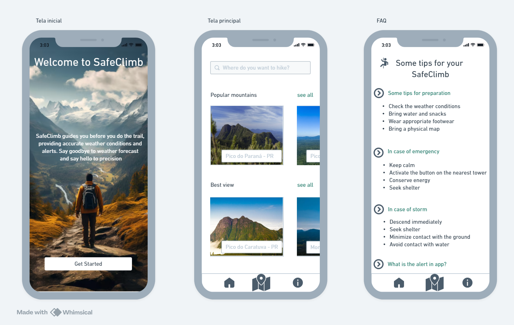

# SafeClimb

SafeClimb is a project that assists climbers with challenges related to weather forecasts and communication. The system uses an ESP32 microcontroller to collect environmental data and send it to the cloud, where it can be accessed via a mobile app. It also sends automatic alerts for critical situations.

## Features

- Collects environmental data (temperature, humidity, etc.) using ESP32.
- Sends data to the cloud via AWS IoT.
- Stores data in DynamoDB.
- Provides APIs to access data via AWS API Gateway and AWS Lambda.

## Project Structure

1. **ESP32**: Collects data from sensors.
2. **AWS IoT**: Receives data from the ESP32.
3. **DynamoDB**: Stores the collected data.
4. **AWS Lambda**: Processes and manipulates the data.
5. **AWS API Gateway**: Provides APIs for data consumption.
6. **Mobile App**: Displays data and notifications to users.

## Images

### Architecture Diagram

### Mobile App Screen

